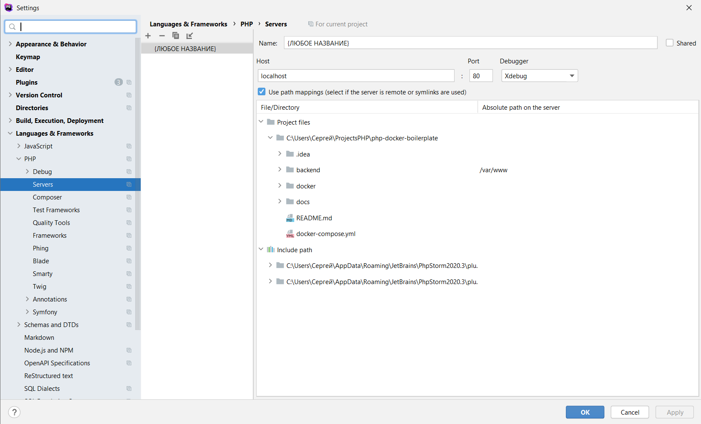

### Описание `docker-compose.yaml`:

```yaml
environment:
  XDEBUG_MODE: develop,debug
  XDEBUG_CONFIG: client_host=host.docker.internal client_port=9000
```

Полный список настроек можно посмотреть на сайте [Xdebug](https://xdebug.org/docs/all_settings). 

Не все настройки можно использовать в переменных окружения (`XDEBUG_CONFIG`).

Для Linux вместо `client_host=host.docker.internal`(для MacOS и Windows) использовать `client_host=IP`!

### Настройка `PhpStorm`:

Добавить Docker сервер:

- ****Для MacOS: PhpStorm > Preferences... (⌘.) > Build, Execution, Deployment > Docker****: 

Для всех добавляемых серверов ниже по инструкции нужно использовать маппинг такой же как в `docker-compose.yaml`:

```yaml
services:
  backend:
    volumes:
      - ./backend/:/var/www/
```

Добавить новый сервер с любым именем и прописать маппинги:

- ****Для Windows: File > Settings > Languages & Frameworks > PHP > Servers****

- ****Для MacOS: PhpStorm > Preferences... (⌘.) > Languages & Frameworks > PHP > Servers****



Добавить конфигурацию запуска:


Запустить дебаггер:


После запуска дебаггера откроется браузер по адресу (`XDEBUG_SESSION_START` прописывает сам PhpStorm): 


Перейдя в PhpStorm в окне дебага видим:


